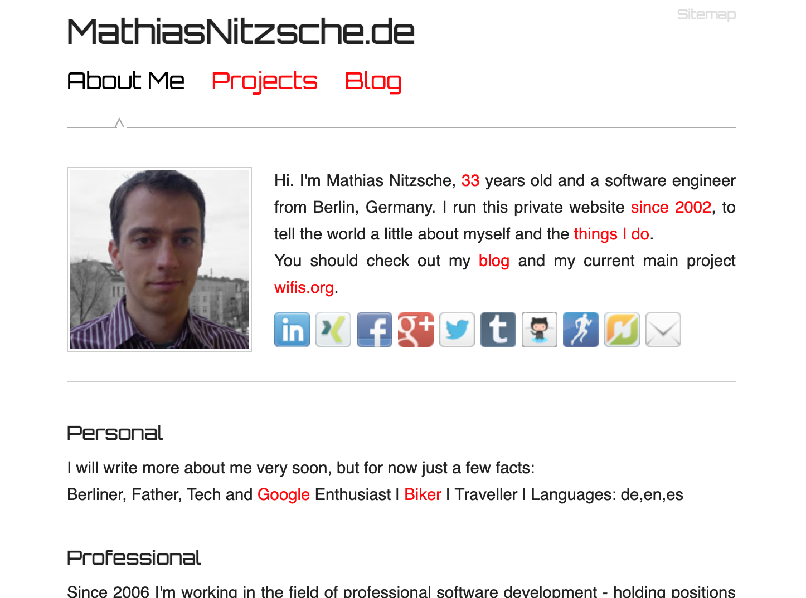

# mathiasnitzsche.de

Since MathiasNitzsche.de (or before MadMaxMatze.de) went live in 2002, it was my little web development playground. The project has teached me a lot - especially what you should not do. In the beginning I just didn't know any better then using table or even iFrame layouts. And we better don't talk anymore about my first PHP or JavaScript steps. Later I completely over engineered with a self made full blown CMS developed in Python, running on Google Apps Engine.

Nowerdays I have other projects and even work to play around with new stuff. A static page, with minimal design hosted via GitHub Pages seemed like the perfect choice to not worry about anything, anymore - which is real evolution in the end!

# 2021 - now (mathiasnitzsche.de)

# 2012 - 2020 (mathiasnitzsche.de)

# 2006 - 2012 (mathiasnitzsche.de)

# 2005 - 2006 (madmaxmatze.de)

# 2004 - 2005 (madmaxmatze.de)

# 2003 - 2004 (madmaxmatze.de)

# 2002 - 2003 (madmaxmatze.de)

